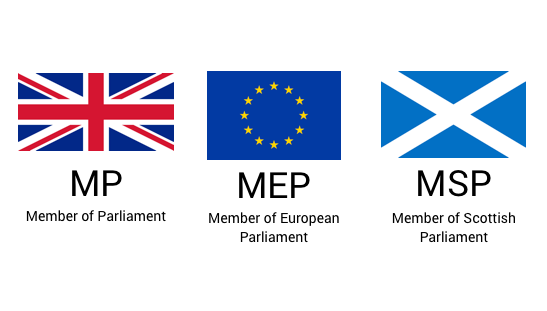

# What is a Democracy?

## Democracy
* People who vote for representatives from a wide list of parties.
* Free speech, can criticise their leaders
* The right to demonstrate
* Independent press and television, trade unions and pressure groups.

## Dictatorship
* People vote for one party or person
* Criticism is punished
* Demonstrations are illegal
* Press, television, trade unions and pressure groups are all controlled by the government.

## Basic Rights in a Democracy
In Scotland, we have the right to elect our representatives and vote on issues such as Scottish Independence. Many people feel that because we have the right to vote that we have a responsibility to use our vote.

### Example
In 2016, almost 40% of people didn't vote, if they did the SNP may not have won.

### Right denied to Women until early last century
Not everyone was allowed to vote when elections began. The fact that people fight so hard for the right to vote is why many people argue it is important to use their right to vote.

#### Example
Suffragettes who fought hard to gain the vote for women.

# Who Represents us?

In Scotland, there are three main people who represent us in Parliament.
* Member of Scottish Parliament (MSP)
* Member of Parliament (MP)
* Member of European Parliament (MEP)

# Campaigning Methods
There are many ways that people who are standing for election can campaign. These are just a few:
* Leadership Debates
* Loudspeakers on Cars
* Political Party Broadcasts
* Taking elderly to vote on election day
* Canvassing - handing out leaflets, going to people's houses
* Use posters

# Voting

## Why use your vote?
The term 'Voter turnout' is the percentage of people who are registered to vote on election day and who actually turned out to vote.

## Why people don't vote
* Don't know who to vote for
* Can't be bothered
* Not responsible enough
* Don't like politics in general
* Too much work

## First Past The Post (FPTP)
The British Electoral System is the term used to describe how we elect representatives to a post. The system used in Britain is called First-past-the-post. This means that the candidate with the most votes in the election is the winner. Britain is divided into 650 constituencies or areas. Each constituency elects one Member of Parliament (MP). This means that there are 650 MP's working in the House of Commons.

The term majority is used to describe the difference between the votes gained by the winner and the runner up.

### Arguments For
* It is fair and easy for voters to understand. The candidate who gets the most votes wins - more people voted for the winning party than for any other. This is fair.
* A voter casts a vote directly for a candidate/party of his/her personal choice.

### Arguments Against
* The system favours the Labour Party and the Conservatives Party at the expense of other parties. These two parties have formed the government for most of the 20th century.
* Most governments have more people voting against them that for them. This is not democratic.

## Proportional Representation (PR)
This is where political parties get seats in Parliament on the proportion of votes they have. For example, a party that gets 20% of votes in an election, will get 20% of votes in Parliament.

## Additional Member System (AMS)
Sometimes Proportional Representation is used along with First Past the Post, this is called the Additional Member System. It is used in Scotland in order to elect MSPs.

### Advantages
* Using Proportion Representation the number of votes a party receives more clearly reflects the number of seats it wins, hopefully ending the feeling of the 'wasted vote'.
* Proportional Representation may help smaller political parties gain seats and representation in Parliament.

### Disadvantages
* Coalition governments may be less stable than a majority government. If Coalition Parties disagree over too much the Coalition can be torn apart and the Government fails.
* Proportional Representation may use a more complicated method of counting the votes and therefore can be more difficult for the voters to understand.

# Scottish Independence

## For Independence
* All Local Authorities in Scotland did not want to leave the European Union.
* Free University and College

## Against Independence
* We could not use the Pound sterling if we left Britain.
* Too poor of a country
* Oil rigs
* Brexit - we would have to leave the European Union too.
* Customs at Scottish border.

# Work of a Member of Scottish Parliament

## Outside of the Parliament
* Holds surgeries
* Attends local meetings
* Attends special events within their constituency

## Inside of the Parliament
* Proposes new laws (bills)
* Voting
* Proposing changes to existing laws

# Bills and Laws

## Process of a Bill becoming a Law.

### Stage 1
* An appropriate committee considers the bill's general principles.
* Committee asks relevant groups and individuals to give evidence about proposals.
* Committee reports to Parliament.
* Parliament debates on and votes on the general principles of the bill.

## Stage 2
* Committee looks in detail at the wording and content of the bill.
* Committee may make amendments to the bill.

## Stage 3
* The whole Parliament considers further amendments to the bill.
* Parliament debates and votes on the final version of the bill.

## Stage 4
* There is a four week period prior when legal challenges to the bill can be made.
* The bill is then sent for Royal Assent (Signature from the Monarch).
